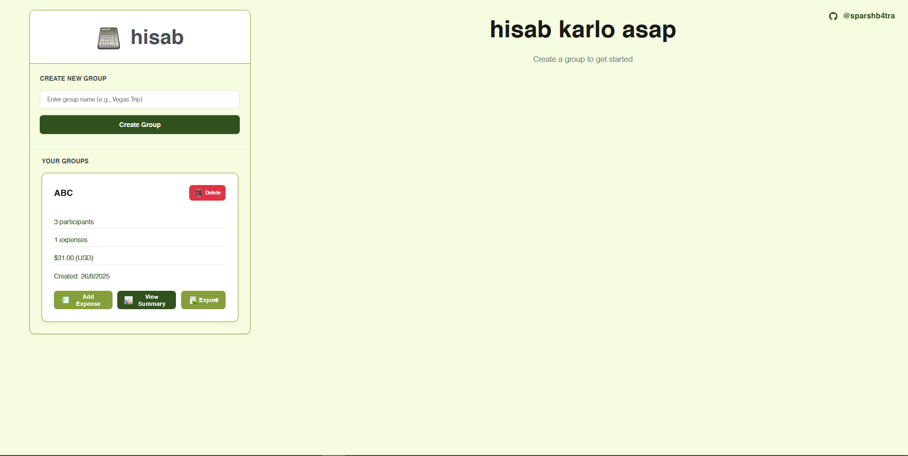
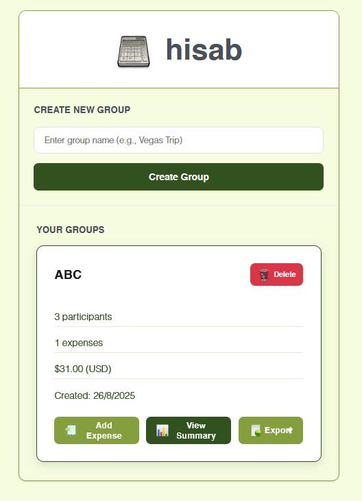
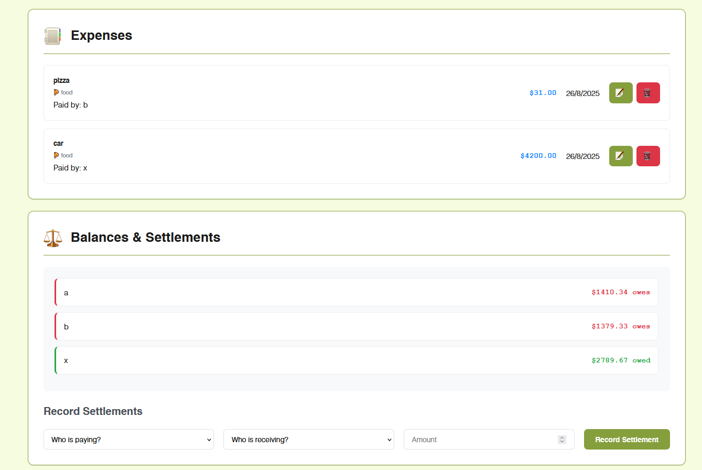
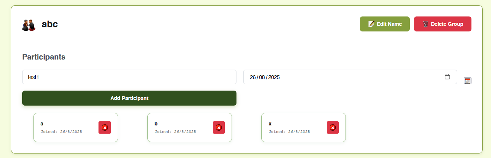
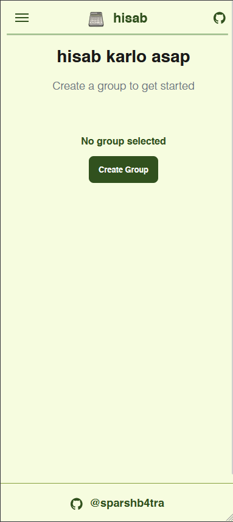
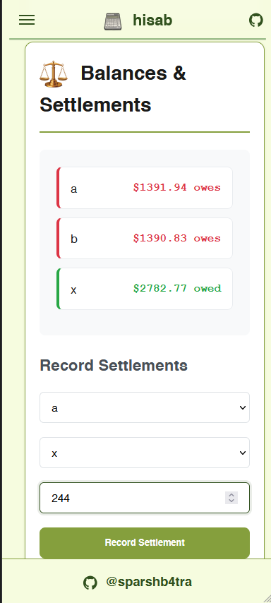
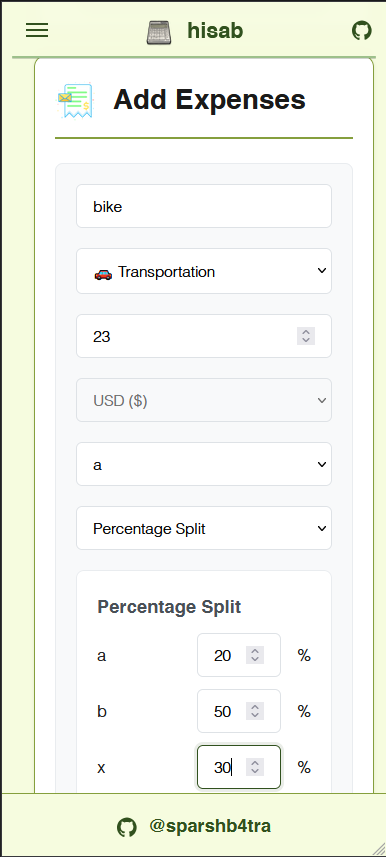
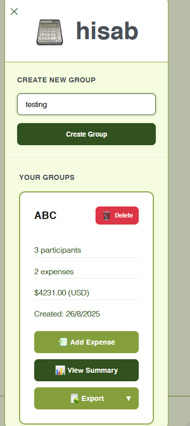

# hisab – split expenses without the spreadsheet anxiety

[](LICENSE)

<p align="center">

</p>

Hisab (Hindi: "account", "reckoning") is a minimal, mobile-first expense splitter. Create a group, add participants, record expenses, and see exactly who owes whom—no sign-up, no fluff, just math that balances.

**Why "hisab"?**
- It's a word friends actually say when settling bills. Approachable and human, not SaaS-y.
- It communicates the product's intent in one breath: quick accounting; clean reckoning.

## Live Demo
- 🌐 **Website**: [hi-sab.netlify.app](https://hi-sab.netlify.app/)
- 💻 **Source Code**: [GitHub Repository](https://github.com/sparshb4tra/hisab)

## Table of Contents
- [Features](#features)
- [UX Highlights](#ux-highlights)
- [Tech Stack](#tech-stack)
- [Screenshots](#screenshots)
- [Getting Started](#getting-started)
- [Usage Guide](#usage-guide)
- [Export Formats](#export-formats)
- [Data Model & Persistence](#data-model--persistence)
- [Validation & Security](#validation--security)
- [Roadmap](#roadmap)
- [Contributing](#contributing)
- [License](#license)

---

## Features

### Core Features (MVP)
- **Group Management**: Create groups/events and add participants with join dates
- **Expense Tracking**: Add expenses with categories and specify who paid
- **Flexible Splitting**: Equal splits, custom amounts, or percentage-based
- **Multi-Currency Support**: Per-group currency (USD, EUR, GBP, CAD, INR) - locked for consistency
- **Real-time Balances**: Instant calculation of who owes whom
- **Settlement Recording**: Track payments between participants  
- **Perspective View**: See balances from any participant's point of view

### Essential Features
- **Expense Management**: Edit/delete expenses with intuitive modals
- **Export Options**: Text (.txt), CSV, and PDF formats with consistent styling
- **Quick Actions**: Sidebar group cards with Add Expense, View Summary, and Export
- **Input Validation**: Number-only fields with real-time error feedback
- **Data Persistence**: Automatic saving via localStorage

### Enhanced UX Features
- **Mobile-First Design**: Off-canvas sidebar with hamburger menu and sticky top bar
- **Join Date Tracking**: Per-participant join dates reflected in group cards
- **Export Overlay**: Single Export button with clear format options
- **Custom Iconography**: Custom icon set with favicon and micro-interactions
- **Clean Typography**: Helvetica for text, Courier New for numbers
- **Minimal Design**: Production-lean color palette focused on usability

---

## UX Highlights

- **Mobile-First Navigation**: Hamburger menu transitions seamlessly until group selection; sticky header for in-group navigation
- **Unified Export Experience**: One Export button reveals three clear format options (TXT, CSV, PDF)
- **Perspective Selector**: "Show me my hisab" - dynamically rewrites all balances from selected participant's viewpoint
- **Brand Consistency**: Non-selectable "hisab" titles serve as logo elements; elegant hover effects for external links
- **Currency Consistency**: Visually locked currency selection per group in expense forms

---

## Tech Stack

- **Frontend**: HTML5, CSS3 (responsive grid/flexbox, glassy micro-interactions)
- **JavaScript**: Vanilla ES6+ with class-based architecture (`ExpenseSplitter`)
- **PDF Generation**: jsPDF library for formatted exports
- **Data Storage**: localStorage for client-side persistence
- **Dependencies**: Zero frameworks, no build process required

---

## Screenshots

### Responsive Design Showcase
Hisab is built with a **mobile-first, fully responsive design** that adapts seamlessly across all screen sizes.

#### Screenshot Organization:
```
public/
├── desktop/
│   ├── 01_desktop.png
│   ├── 02_desktop.png
│   ├── 03_desktop.png
│   ├── 04_desktop.png
│   ├── 05_desktop.png
│   └── 07_desktop.png
├── mobile/
│   ├── 01_mobile.png
│   ├── 02_mobile.png
│   ├── 03_mobile.png
│   ├── 04_mobile.png
│   ├── 05_mobile.png
│   ├── 06_mobile.png
│   └── 07_mobile.png
```

### Desktop Experience
<div align="center">

| [](public/desktop/01_desktop.png) | [](public/desktop/02_desktop.png) |
|:---:|:---:|
| *Clean, spacious layout with full sidebar navigation* | *Intuitive group creation with currency selection* |
| [](public/desktop/05_desktop.png) | [](public/desktop/03_desktop.png) |
| *Comprehensive balance overview with perspective selector* | *Streamlined expense input with split options* |

*Click any image to view full size*

</div>

### Mobile Experience
<div align="center">

| [](public/mobile/01_mobile.png) | [](public/mobile/06_mobile.png) |
|:---:|:---:|
| *Mobile-first design with hamburger navigation* | *Off-canvas sidebar with smooth animations* |

| [](public/mobile/04_mobile.png) | [](public/mobile/02_mobile.png) |
|:---:|:---:|
| *Touch-optimized forms with clear visual hierarchy* | *Mobile-friendly balance cards and actions* |

*Click any image to view full size*

</div>

---

## Getting Started

### Option A: Direct Usage
Clone the repository and open `index.html` directly in your browser:
```bash
git clone https://github.com/sparshb4tra/hisab.git
cd hisab
# Open index.html in your browser
```

### Option B: Local Server (Recommended)
For optimal experience with PDF exports and font loading:
```bash
# Using npx serve
npx serve .

# Or using Python
python -m http.server 5173

# Or any static file server of your choice
```
Then visit `http://localhost:5173` (or your chosen port).

---

## Usage Guide

1. **Create a Group**: Start by creating a group and selecting a currency (locked for consistency)
2. **Add Participants**: Add group members - their join dates are automatically captured
3. **Record Expenses**: 
   - Choose splitting method: equal, custom amounts, or percentages
   - Select "Who paid?" from group participants
   - Add categories for better organization
4. **Track Settlements**: Record actual payments between participants
5. **View Summary**: 
   - See overall group balances
   - Switch perspective to any participant's view ("my hisab")
6. **Export Data**: Generate reports in Text, CSV, or PDF format from Summary or group cards

---

## Export Formats

| Format | Description | Use Case |
|--------|-------------|----------|
| **Text (.txt)** | Human-readable summary with clear formatting | Quick sharing via messaging apps |
| **CSV** | Machine-friendly data with direction columns ("Owed"/"Owes") | Spreadsheet import, data analysis |
| **PDF** | Professionally formatted report with participants, expenses, and totals | Formal record-keeping, printing |

---

## Data Model & Persistence

- **Storage**: All data persists in browser's `localStorage`
- **Structure**: Groups contain participants, expenses, and currency settings
- **Settlements**: Keyed by `currentGroupId` for efficient retrieval  
- **Backward Compatibility**: Automatic migration helper (`migrateParticipants`) ensures older data formats remain functional

---

## Validation & Security

- **Input Validation**: Amount fields enforce numeric input with real-time error feedback
- **XSS Prevention**: All user-rendered strings are sanitized to prevent HTML injection
- **Precision Handling**: Money calculations performed in integer cents to avoid floating-point errors
- **Fair Distribution**: Equal/percentage splits use remainder reconciliation for accurate totals

---

## Roadmap

### Near Term
- [ ] Optional backend integration (authentication + database) for multi-device sync
- [ ] Invite links with role-based permissions
- [ ] Full app state import/export (JSON format)

### Future Enhancements  
- [ ] Multi-currency conversion with exchange rate locking
- [ ] Comprehensive test suite (unit tests for split logic, e2e user flows)
- [ ] Advanced expense categorization and filtering
- [ ] Receipt photo attachments

---

## Contributing

We welcome issues and pull requests! When contributing:

- **Design Philosophy**: Maintain minimal, clean design principles
- **Code Quality**: Keep logic readable and well-documented
- **User Experience**: Ensure changes don't introduce friction or complexity

Please open an issue before starting major feature work to discuss the approach.

---

## License

MIT © [sparshb4tra](https://github.com/sparshb4tra) — see [LICENSE](LICENSE) for details.

---

<div align="center">
  <sub>Built with ❤️ for splitting bills without the spreadsheet headaches</sub>
</div>

---


# hisab – split expenses without the spreadsheet anxiety

[](LICENSE)

Hisab (Hindi: "account", "reckoning") is a minimal, mobile-first expense splitter. Create a group, add participants, record expenses, and see exactly who owes whom—no sign-up, no fluff, just math that balances.

**Why "hisab"?**
- It's a word friends actually say when settling bills. Approachable and human, not SaaS-y.
- It communicates the product's intent in one breath: quick accounting; clean reckoning.

## Live Demo
- 🌐 **Website**: [hi-sab.netlify.app](https://hi-sab.netlify.app/)
- 💻 **Source Code**: [GitHub Repository](https://github.com/sparshb4tra/hisab)

## Table of Contents
- [Features](#features)
- [UX Highlights](#ux-highlights)
- [Tech Stack](#tech-stack)
- [Screenshots](#screenshots)
- [Getting Started](#getting-started)
- [Usage Guide](#usage-guide)
- [Export Formats](#export-formats)
- [Data Model & Persistence](#data-model--persistence)
- [Validation & Security](#validation--security)
- [Roadmap](#roadmap)
- [Contributing](#contributing)
- [License](#license)

---

## Features

### Core Features (MVP)
- **Group Management**: Create groups/events and add participants with join dates
- **Expense Tracking**: Add expenses with categories and specify who paid
- **Flexible Splitting**: Equal splits, custom amounts, or percentage-based
- **Multi-Currency Support**: Per-group currency (USD, EUR, GBP, CAD, INR) - locked for consistency
- **Real-time Balances**: Instant calculation of who owes whom
- **Settlement Recording**: Track payments between participants  
- **Perspective View**: See balances from any participant's point of view

### Essential Features
- **Expense Management**: Edit/delete expenses with intuitive modals
- **Export Options**: Text (.txt), CSV, and PDF formats with consistent styling
- **Quick Actions**: Sidebar group cards with Add Expense, View Summary, and Export
- **Input Validation**: Number-only fields with real-time error feedback
- **Data Persistence**: Automatic saving via localStorage

### Enhanced UX Features
- **Mobile-First Design**: Off-canvas sidebar with hamburger menu and sticky top bar
- **Fully Responsive**: Seamless experience across desktop, tablet, and mobile devices
- **Join Date Tracking**: Per-participant join dates reflected in group cards
- **Export Overlay**: Single Export button with clear format options
- **Custom Iconography**: Custom icon set with favicon and micro-interactions
- **Clean Typography**: Helvetica for text, Courier New for numbers
- **Minimal Design**: Production-lean color palette focused on usability

---

## UX Highlights

- **Mobile-First Navigation**: Hamburger menu transitions seamlessly until group selection; sticky header for in-group navigation
- **Unified Export Experience**: One Export button reveals three clear format options (TXT, CSV, PDF)
- **Perspective Selector**: "Show me my hisab" - dynamically rewrites all balances from selected participant's viewpoint
- **Brand Consistency**: Non-selectable "hisab" titles serve as logo elements; elegant hover effects for external links
- **Currency Consistency**: Visually locked currency selection per group in expense forms

---

## Tech Stack

- **Frontend**: HTML5, CSS3 (responsive grid/flexbox with mobile-first approach, glassy micro-interactions)
- **JavaScript**: Vanilla ES6+ with class-based architecture (`ExpenseSplitter`)
- **Responsive Design**: CSS Grid and Flexbox for seamless adaptation across all screen sizes
- **PDF Generation**: jsPDF library for formatted exports
- **Data Storage**: localStorage for client-side persistence
- **Dependencies**: Zero frameworks, no build process required

---

## Screenshots

> **Note**: Add your screenshots to the `public/` directory and update the paths below.

### Responsive Design Showcase
Hisab is built with a **mobile-first, fully responsive design** that adapts seamlessly across all screen sizes.

#### Screenshot Organization:
```
public/
├── desktop/
│   ├── 01_home_desktop.png
│   ├── 02_create_group_desktop.png
│   ├── 03_add_participants_desktop.png
│   ├── 04_add_expense_desktop.png
│   ├── 05_summary_desktop.png
│   └── 07_sidebar_cards_desktop.png
├── mobile/
│   ├── 01_home_mobile.png
│   ├── 02_create_group_mobile.png
│   ├── 03_add_participants_mobile.png
│   ├── 04_add_expense_mobile.png
│   ├── 05_summary_mobile.png
│   ├── 06_hamburger_menu_mobile.png
│   └── 07_sidebar_cards_mobile.png
└── interactions/
    └── 06_export_overlay.gif
```


> **Troubleshooting**: If images aren't displaying, verify your file paths match the structure above and that files are committed to your repository.

---

## Getting Started

### Option A: Direct Usage
Clone the repository and open `index.html` directly in your browser:
```bash
git clone https://github.com/sparshb4tra/hisab.git
cd hisab
# Open index.html in your browser
```

### Option B: Local Server (Recommended)
For optimal experience with PDF exports and font loading:
```bash
# Using npx serve
npx serve .

# Or using Python
python -m http.server 5173

# Or any static file server of your choice
```
Then visit `http://localhost:5173` (or your chosen port).

---

## Usage Guide

1. **Create a Group**: Start by creating a group and selecting a currency (locked for consistency)
2. **Add Participants**: Add group members - their join dates are automatically captured
3. **Record Expenses**: 
   - Choose splitting method: equal, custom amounts, or percentages
   - Select "Who paid?" from group participants
   - Add categories for better organization
4. **Track Settlements**: Record actual payments between participants
5. **View Summary**: 
   - See overall group balances
   - Switch perspective to any participant's view ("my hisab")
6. **Export Data**: Generate reports in Text, CSV, or PDF format from Summary or group cards

---

## Export Formats

| Format | Description | Use Case |
|--------|-------------|----------|
| **Text (.txt)** | Human-readable summary with clear formatting | Quick sharing via messaging apps |
| **CSV** | Machine-friendly data with direction columns ("Owed"/"Owes") | Spreadsheet import, data analysis |
| **PDF** | Professionally formatted report with participants, expenses, and totals | Formal record-keeping, printing |

---

## Data Model & Persistence

- **Storage**: All data persists in browser's `localStorage`
- **Structure**: Groups contain participants, expenses, and currency settings
- **Settlements**: Keyed by `currentGroupId` for efficient retrieval  
- **Backward Compatibility**: Automatic migration helper (`migrateParticipants`) ensures older data formats remain functional

---

## Validation & Security

- **Input Validation**: Amount fields enforce numeric input with real-time error feedback
- **XSS Prevention**: All user-rendered strings are sanitized to prevent HTML injection
- **Precision Handling**: Money calculations performed in integer cents to avoid floating-point errors
- **Fair Distribution**: Equal/percentage splits use remainder reconciliation for accurate totals

---

## Roadmap

### Near Term
- [ ] Optional backend integration (authentication + database) for multi-device sync
- [ ] Invite links with role-based permissions
- [ ] Full app state import/export (JSON format)

<div align="center">
  <sub>Built with ❤️ for splitting bills without the spreadsheet headaches</sub>
</div>
